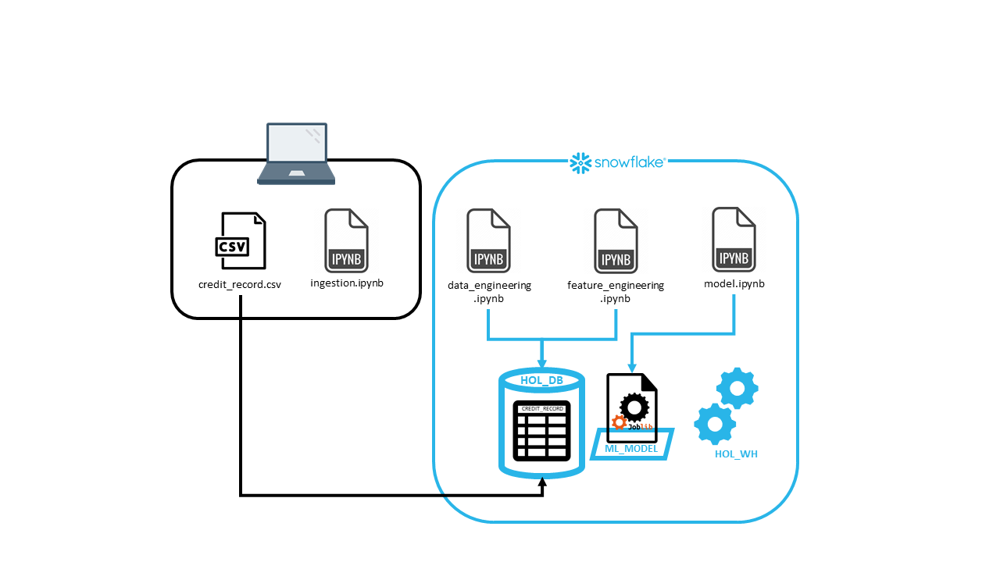

# PoC Snowflake
Internship subject - Study of the lakehouse pattern and PoC of the cloud data platform Snowflake

## Objective

This project aims to evaluate the cloud data platform Snowflake as a tool for AI worloads. Snowflake is an implementation of the lakehouse pattern, merging two reknowned patterns : warehouse and data lake. The lakehouse pattern combines the best of them : 

- Elastic storage at low cost thanks to data lake + governance, security and data management thanks to warehouse
- Storage for structured, semi-structured and unstructured data supported by data lake
- Raw and consildated data for complete information as well as ready-to-use data in model training
- Wide range of application : BI, ML, AI

Implementation of this pattern can looks like a cloud data storage with multiple virtual warehouse on top of it, as Snowflake is.

## Snowflake tools for Machine Learning

We want to challenge the tools and functionalities of Snowflake for Machine Learning : 
- Snowpark API is a framework developed by Snowflake that enables you to write code in popular programming languages such as Java, Scala and Python to perform complex data transformations and analyses directly in Snowflake. Use cases: data exploration, data engineering, model training
- Stored procedures are blocks of SQL, Python or Java code. They can be used to encapsulate complex, reusable operations. Once a stored procedure has been created, it can be called. Use cases: model training, model deployment
- UDFs (user-defined functions) are used to perform specific, reusable calculations on data as part of SQL queries. They return a specific value. Use case: inference
- Snowpark-optimized warehouses aim to provide an optimized, high-performance environment for execution in Snowflake using the Snowpark framework. Use case: everything, as long as we are using Snowpark or procedure/udf.

## Projet architecture 

Here is the architecture of my project : 

The files feature_engineering.ipynb and model.ipynb are actually in the same file model.ipynb, as the feature enginering takes place in the pipeline of the grid search cross-validation. The schema here is not actually accurate but helps understand what can be done with Snowflake.

## Data 

The dataset used here is Base.csv from Bank Account Fraud Dataset Suite (NeurIPS 2022), that can be found [here](https://www.kaggle.com/datasets/sgpjesus/bank-account-fraud-dataset-neurips-2022).
